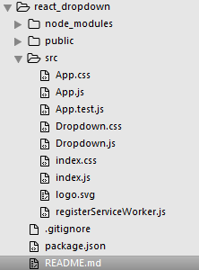

# 练习react--写一个下拉框组件

待完善：
目前使用state承载子组件向父组件传递的数据,
尝试使用redux处理数据传递去改进

使用

git clone https://github.com/YooHannah/react_dropdown.git //download

npm install //安装包

npm start //运行

主要文件为Dropdown.css和Dropdown.js

文件目录

